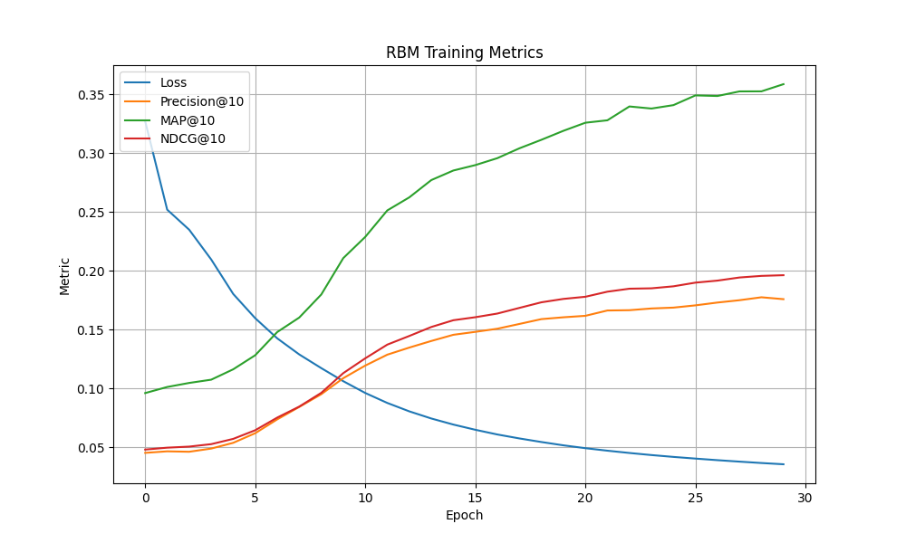

# Anime Recommendation System (RBM + PyTorch)

An anime recommendation system that uses a **Restricted Boltzmann Machine (RBM)** for collaborative filtering. The system provides personalized anime recommendations based on user preferences, and includes a web interface built with react and a rest api using flask.

---

## Features

- RBM-based collaborative filtering model (PyTorch)
- CUDA GPU acceleration (auto-detected)
- Precision@K, MAP@K, and NDCG@K evaluation
- Interactive CLI to generate top-N recommendations
- REST API (Flask, served via Gunicorn in production) for backend services
- Production-ready Docker & Docker Compose setup
- React web UI for searching and getting recommendations
- Grid search for hyperparameter tuning with CSV logs
- Outputs recommendation CSVs and training plots

---

## Tech Stack

- **Backend:** Python, Flask, PyTorch, Gunicorn, RBM
- **Frontend:** React, JavaScript, Nginx (Dockerized)
- **Deployment:** Docker, Docker Compose
- **Other:** pandas, numpy, seaborn, flask-cors

---

## Dataset

**Source**: [MyAnimeList's Anime and User-Anime interactions](https://www.kaggle.com/datasets/bsurya27/myanimelists-anime-and-user-anime-interactions/data)

- Converted ratings into implicit binary format (liked = rating ≥ 7)
- Filtered out:
  - Users with < 100 liked anime
  - Anime with < 50 likes
  - Hentai genre
- Pivoted into a user-item matrix

---

## Model: Restricted Boltzmann Machine (RBM)

- Binary input vector: whether a user liked an anime
- Learns hidden representations and reconstructs unseen preferences
- Evaluated using ranking metrics over held-out anime

---

## Project Structure

```
anime-recommendation/
├── .dockerignore
├── .gitignore
├── hyperparameter_tuning.py
├── data_analysis.ipynb
├── api.py
├── main.py
├── build_metadata_cache.py
├── config.yaml
├── requirements.txt
├── Dockerfile
├── docker-compose.yml
├── README.md
├── data/
│   ├── datasets/
│   ├── anime_metadata.json
├── out/
│   ├── tuning_results.csv
│   ├── training_metrics.png
│   ├── recommendations.csv
│   └── rbm_best_model.pth
├── src/
│   ├── data_loader.py
│   ├── evaluate.py
│   ├── model.py
│   ├── train.py
│   └── utils.py
├── anime-recommender-ui/
│   ├── .env
│   ├── Dockerfile
│   ├── .dockerignore
│   ├── package.json
│   ├── package-lock.json
│   ├── public/
│   │   ├── index.html
│   │   ├── favicon.ico
│   │   └── bg.png
│   └── src/
│       ├── App.js
│       ├── App.css
│       ├── index.js
│       ├── index.css
│       ├── components/
│       │   ├── SearchBar.js
│       │   └── AnimeCard.js
│       ├── pages/
│       │   └── Home.js
│       └── utils/
│           └── api.js
```

---

## Installation

### 1. Clone the repo
```bash
git clone https://github.com/yourusername/anime-recommendation.git
cd anime-recommendation
```
### 2. Set up a virtual environment
```bash
python3 -m venv venv
source venv/bin/activate
```
### 3. Install Python backend dependencies
```bash
pip install -r requirements.txt
```

### 4. Install frontend dependencies
```bash
cd anime-recommender-ui
npm install
```
### 5. (Optional) Train the model
```bash
python main.py --train
```
### 6. (Optional) Hyperparameter tuning
```bash
python hyperparameters_tuning.py
```

---

## Quickstart (with Docker)

Run backend (Flask API) and frontend (React UI) together using Docker Compose:

```bash
docker-compose up --build
```

  - Frontend: http://localhost
  - API: http://localhost:5000

---

## Running Locally

### Start backend (Flask API):
```bash
python api.py
```
### Start frontend (React UI) in a new terminal:
```bash
cd anime-recommender-ui
npm start
```

---

## Config File

Training settings can be changed in `config.yaml`:
```yaml
model:
  n_hidden: 1024
  learning_rate: 0.001
  batch_size: 32
  epochs: 30
  k: 10
data:
  holdout_ratio: 0.1
  min_likes_user: 100
  min_likes_anime: 50
paths:
  model_path: out/rbm_best_model.pth
```
---

## Environment Variables

The frontend expects a `.env` file in the `anime-recommender-ui/` directory.

1. Go to the frontend directory:
    ```bash
    cd anime-recommender-ui/
    ```

2. Copy the example environment file:
    ```bash
    cp .env.example .env
    ```

3. Edit `.env` and set the API URL as needed:

    - For Docker Compose:
      ```env
      REACT_APP_API_URL=http://backend:5000
      ```
    - For local development:
      ```env
      REACT_APP_API_URL=http://localhost:5000
      ```

---

## Outputs

- `recommendations.csv` – top-N anime per user + hit flag
- `training_metrics.png` – training loss and evaluation metrics
- `rbm_best_model.pth` – best saved weights

---

## Evaluation Metrics

| Metric       | Description |
|--------------|-------------|
| **Precision@K** | Measures how many of the top K recommended anime were actually relevant (i.e., liked by the user). |
| **MAP@K**       | Mean Average Precision at K: captures both correctness and order of recommendations. |
| **NDCG@K**      | Normalized Discounted Cumulative Gain: gives higher weight to relevant items ranked higher. |

