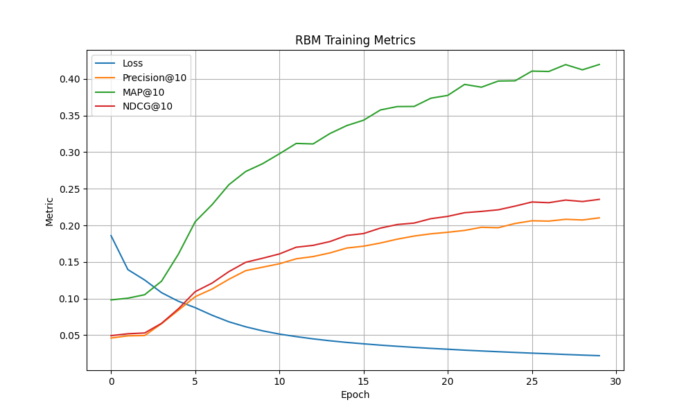

# Anime Recommendation System (RBM + PyTorch)

A collaborative filtering recommendation system that uses a **Restricted Boltzmann Machine (RBM)** to suggest anime based on user preferences. The model is trained using implicit feedback (liked anime), accelerated on GPU with PyTorch.

---

## Features

- RBM-based collaborative filtering model
- CUDA GPU acceleration (auto-detected)
- Precision@K, MAP@K, and NDCG@K for evaluation
- Interactive CLI to generate top-N anime recommendations
- Grid search tuning with logged results
- Generates recommendation CSVs and training plots

---

## Dataset

**Source**: [Anime Recommendation Database 2020 on Kaggle](https://www.kaggle.com/datasets/hernan4444/anime-recommendation-database-2020)

- Converted ratings into implicit binary format (liked = rating ≥ 7)
- Filtered out:
  - Users with < 700 liked anime
  - Anime with < 100 likes
  - Hentai genre (for safety)
- Pivoted into a user-item matrix

---

## Model: Restricted Boltzmann Machine (RBM)

- Binary input vector: whether a user liked an anime
- Learns hidden representations and reconstructs unseen preferences
- Evaluated using ranking metrics over held-out anime

---

## Project Structure

```
anime-recommendation/
├── main.py                    
├── tune_hyperparameters.py    
├── config.yaml                
├── data_analysis.ipynb        
├── training_metrics.png       
├── recommendations.csv        
├── requirements.txt
├── data/
│   └── datasets/
├── src/
│   ├── data_loader.py
│   ├── model.py
│   ├── train.py
│   ├── evaluate.py
│   └── utils.py
```

## How to Run

### 1. Install dependencies
```bash
pip install -r requirements.txt
```

### 2. Train the model
```bash
python main.py --train
```

### 3. Launch the recommender
```bash
python main.py
```

### 4. Hyperparameter tuning
```bash
python tune_hyperparameters.py
```

Logged results saved to `tuning_results.csv`

---

## Config File

You can change all training settings in \`config.yaml\`:
```yaml
model:
  n_hidden: 1024
  learning_rate: 0.001
  batch_size: 64
  epochs: 20
  k: 10
data:
  holdout_ratio: 0.1
  min_likes_user: 700
  min_likes_anime: 100
paths:
  model_path: rbm_best_model.pth
```

---

## Outputs

- `recommendations.csv` – top-N anime per user + hit flag
- `training_metrics.png` – training loss and evaluation metrics
- `rbm_best_model.pth` – best saved weights

---

## Evaluation Metrics

| Metric     ||
|------------|-------------------------------------------|
| Precision@K | Fraction of recommended anime that were held-out|
| MAP@K      | Mean average precision per user|
| NDCG@K     | Ranking quality based on position|

